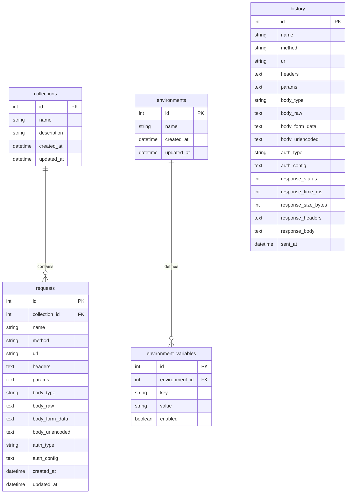

# Scalar API Client

An advanced, developer-first API client platform designed for building, testing, and debugging HTTP requests. The platform offers collections management, request runner execution, full history logging, and environment variables with double-curly-braces template replacement. 

Outbound HTTP requests are proxied by a local backend server to bypass browser CORS constraints, allowing you to test any API endpoint.

## Technical Stack

- **Frontend**: Next.js (TypeScript) & React (styled with a custom Vanilla CSS dark theme)
- **Backend**: Python with FastAPI
- **Database**: SQLite (managed via SQLAlchemy ORM)
- **Core Libraries**:
  - Python: `fastapi`, `uvicorn`, `sqlalchemy`, `pydantic`, `httpx`
  - JavaScript/TypeScript: `next`, `react`, `react-dom`, `lucide-react` (for icons)

---

## Key Features

1. **Workspace Layout & Navigation**:
   - Sidebar containing collapsible collections and execution history.
   - Central request editor using a tabbed system for managing multiple requests concurrently.
   - Top navbar with environment selection dropdown and settings interface.
2. **Request Builder**:
   - HTTP Methods: GET, POST, PUT, PATCH, DELETE, HEAD, OPTIONS.
   - Parameters Editor: Key-value table synced in real-time with the URL query parameters.
   - Headers Editor: Key-value table for custom request headers.
   - Authorization: Bearer Token and Basic Auth support.
   - Body Editor: Supports `none`, `raw` (JSON/text), `form-data`, and `x-www-form-urlencoded`.
3. **Outbound Proxy Runner**:
   - Executes requests through the backend using `httpx` to bypass CORS limits.
   - Handles network timeouts, unreachable hosts, and returns metrics like status code, response time (ms), and size (bytes).
4. **Collections (CRUD)**:
   - Create, rename, delete collections in the sidebar.
   - Add requests directly into collections.
   - Save modified tab details (URL, method, parameters, headers, body, auth) back to the database.
5. **Environments & Variables**:
   - Create and manage environments with variables in a key-value format.
   - Reference variables in request elements (URL, headers, auth, body) using `{{variable_name}}` syntax.
   - Backend resolves these variables at request-send time.
6. **History**:
   - Sent requests are automatically logged into the sidebar history.
   - Clicking a history item repopulates the request builder with the saved request template.
   - Clear history logs or delete specific runs.

---

## Database Schema (SQLite)

The application uses five tables to store and relate user configurations:



---

## Setup Instructions

### Prerequisites
- Node.js (version 18 or above)
- Python (version 3.10 or above)
- SQLite3 

### 1. Backend Setup & Database Seeding

1. Open a terminal and navigate to the `backend` folder:
   ```bash
   cd backend
   ```
2. Install Python dependencies:
   * Standard Python installation:
     ```bash
     python -m venv .venv
     # Windows:
     .venv\Scripts\activate
     # Linux/MacOS:
     source .venv/bin/activate
     pip install -r requirements.txt
     ```
   * MSYS2 / MinGW Python installation:
     ```bash
     pacman -S mingw-w64-ucrt-x86_64-python-fastapi mingw-w64-ucrt-x86_64-python-pydantic mingw-w64-ucrt-x86_64-python-sqlalchemy mingw-w64-ucrt-x86_64-python-httpx mingw-w64-ucrt-x86_64-uvicorn
     ```
3. Seed the database with default collections, request templates, and environments:
   ```bash
   python seed.py
   ```
4. Start the FastAPI backend:
   ```bash
   uvicorn main:app --reload --port 8000
   ```
   The backend API will run at `http://localhost:8000`.

### 2. Frontend Setup

1. Open a new terminal and navigate to the `frontend` folder:
   ```bash
   cd frontend
   ```
2. Install Node.js dependencies:
   ```bash
   npm install --legacy-peer-deps
   ```
3. Start the Next.js development server:
   ```bash
   npm run dev
   ```
   The user interface will be accessible in your web browser at `http://localhost:3000`.
